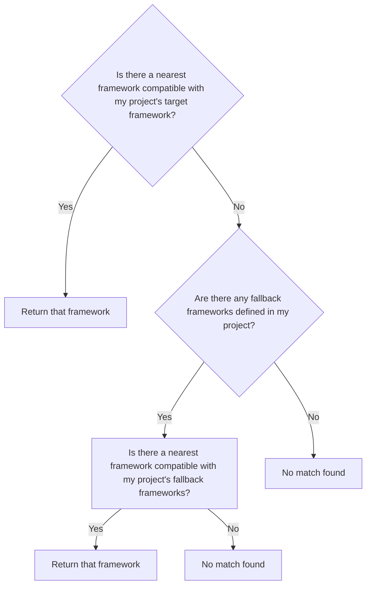
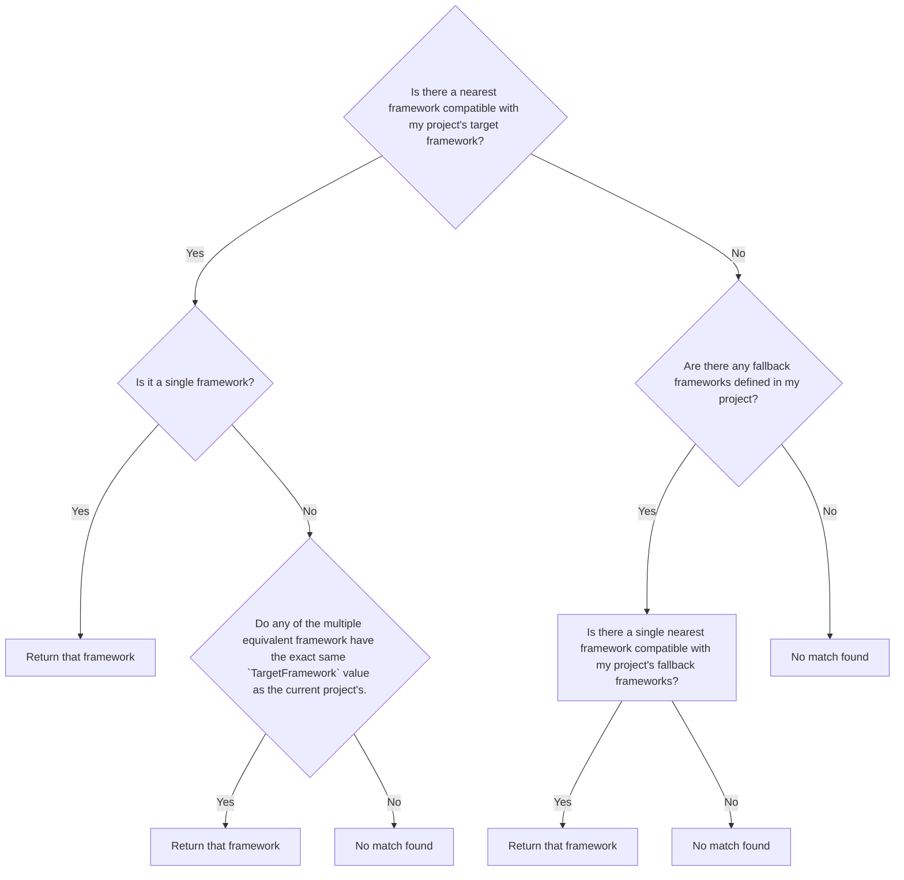

# Support for handling multiple equivalent framework

- [Nikolche Kolev](https://github.com/nkolev92), [Andy Zivkovic](https://github.com/zivkan)
- GitHub Issue ([5154](https://github.com/NuGet/Home/issues/5154)) - Treat Target Framework as Aliases

## Summary

.NET SDK projects are capable of multi targeting based on a target framework where you can have different dependencies for each framework.
In some cases, it is convenient to multi target based on different pivots such as target application version or maybe the specific runtime, as packages can contain runtime assets.
This proposal covers the steps that need to be taken to enable that capability.

## Motivation

Allowing the same framework to be using multiple times in restore would allow customers to:

- Use the same project to generate runtime specific assemblies based on the same target framework.
  - Enable support for building for multiple RIDs, similar to how TargetFrameworks works - Evidence: <https://github.com/dotnet/sdk/issues/9795>
- Allow the same project to target different Visual Studio versions, like for example 17.x and 18.x of Visual Studio.
- Make it easier to run benchmarks, by allowing the same framework to reference 2 different package versions in 2 different build legs

## Explanation

### Functional explanation

#### Background - TargetFramework values are already aliases

NuGet, and the .NET SDK more generally, uses `TargetFrameworkMoniker` and `TargetPlatformMoniker` for project and package compatibility.
Each of the two `*Moniker` properties are composed of `*Identifier` and `*Version` properties, which NuGet doesn't use, but might be used by other components, so should also be set correctly.
If these properties do not have values, the .NET SDK will infer the values by parsing the `TargetFramework` property, which is what we typically see defined in project files.
However, if the `TargetFrameworkMoniker` property is defined explicitly (`TargetPlatformMoniker` is allowed be be undefined), NuGet (and several other components, like the .NET SDK and Visual Studio's dotnet/project-system) will already treat these values as aliases.

For example, the following is a valid project that works before this spec is implemented.

```xml
<Project Sdk="Microsoft.NET.Sdk">

  <PropertyGroup>
    <TargetFramework>banana</TargetFramework>
  </PropertyGroup>

  <PropertyGroup Condition=" '$(TargetFramework)' == 'banana' ">
    <TargetFrameworkIdentifier>.NETFramework</TargetFrameworkIdentifier>
    <TargetFrameworkVersion>v4.7.2</TargetFrameworkVersion>
    <TargetFrameworkMoniker>.NETFramework,Version=v4.7.2</TargetFrameworkMoniker>
  </PropertyGroup>

</Project>
```

```console
C:\Code\Temp\Aliases [main]> dotnet restore
  Determining projects to restore...
  Restored C:\Code\Temp\Aliases\Aliases.csproj (in 47 ms).

C:\Code\Temp\Aliases [main]> dotnet build --framework banana
MSBuild version 17.3.0+92e077650 for .NET
  Determining projects to restore...
  All projects are up-to-date for restore.
  Aliases -> C:\Code\Temp\Aliases\bin\Debug\banana\Aliases.dll

Build succeeded.
    0 Warning(s)
    0 Error(s)

Time Elapsed 00:00:00.27

C:\Code\Temp\Aliases [main]> dotnet publish --framework banana
MSBuild version 17.3.0+92e077650 for .NET
  Determining projects to restore...
  All projects are up-to-date for restore.
  Aliases -> C:\Code\Temp\Aliases\bin\Debug\banana\Aliases.dll
  Aliases -> C:\Code\Temp\Aliases\bin\Debug\banana\publish\
```

However, what doesn't currently work is when multiple TargetFramework values resolve to the same `*Moniker` property value.

#### The proposal

Only .NET SDK projects will support aliasing, as they are the only ones that support multiple frameworks.
Aliasing requires all the tooling (.NET SDK, Visual Studio) to be aliasing aware, since there are some breaking changes in the files that these components depend on.
In .NET 10.0.100, you would get an error if you tried to create a project with 2 of the same framework.
If someone tries to target duplicate frameworks using a Visual Studio version that's aliasing aware, but pins a .NET SDK version that is not aliasing aware, an error will be raised indicating that the scenario requires a tooling upgrade.

Note that projects and SDKs are responsible for setting the `TargetFramework*` and `TargetPlatform*` properties, which NuGet uses as the canonical framework to use for compatibility checks.
Therefore, the exact `TargetFrameworks` value is not important to NuGet, as it is the responsibility of either the SDK author, or the project owner, to set a value that is reasonable to them.

The changes proposed in this document will enable the following hypothetical scenarios.

Firstly, a single project that creates multiple platform specific assemblies, all targeting the same .NET version.

```xml
<Project Sdk="Microsoft.NET.Sdk">

  <PropertyGroup>
    <TargetFrameworks>linux;mac</TargetFrameworks>
  </PropertyGroup>

  <PropertyGroup>
    <TargetFrameworkIdentifier>.NETCoreApp</TargetFrameworkIdentifier>
    <TargetFrameworkVersion>v6.0</TargetFrameworkVersion>
    <TargetFrameworkMoniker>.NETCoreApp,Version=v6.0</TargetFrameworkMoniker>

    <DefineConstants>$(DefineConstants);$(TargetFramework)</DefineConstants>  
    <AssemblyName>$(MSBuildThisFileName).$(TargetFramework)</AssemblyName>
  </PropertyGroup>

</Project>
```

Another example would be a Visual Studio Extension project targeting multiple versions of VS could look similar to the following.
In this example, the Visual Studio Extensibility SDK would be responsible for setting `TargetFrameworkIdentifier`, `TargetFrameworkVersion` and `TargetFrameworkMoniker` properties.

```xml
<Project Sdk="Microsoft.VisualStudio.Extensibility.Sdk">

  <PropertyGroup>
    <TargetFrameworks>vs18;vs17.14</TargetFrameworks>
  </PropertyGroup>

</Project>
```

- When a project reference is made to a project with aliases, the TargetFramework will serve as a secondary pivot in case the standard get nearest target framework returns more than one option.
The technical explanation has [the gory details](#project-to-project-references)
- Packages lock file will also be extended to support aliasing. The file format will need to be updated, but it's already version and that work should be straightforward. [Packages Lock File technical details](#lock-file-changes).
- Visual Studio Package Manager UI does not have great support for multi-targeting and no new work is being proposed here. This is a specific flavor of multi-targeting, and as such no difference from the challenges we have today. [Visual Studio challenges](#visual-studio-challenges)
- dotnet package add, dotnet package update and dotnet package list will all be updated to support per framework operations in case they do not support it already.
- Block aliases containing path separator characters for the time being.

### Pack and duplicate frameworks

There is no intuitive solution to the pack scenario. Given a project with multiple versions of the same framework, pack will fail by default in the first iteration.

There are various scenarios where this could be useful.

- Project building a .NET package for multiple runtimes with API and dependencies represented in runtime-less output.
- Project building a roslyn analyzer targeting multiple roslyn versions, omitting all dependencies.

There are 2 important considerations to enable packing of aliased projects.

- Dependencies - There is only possible dependency list in the nuspec, so only one alias can be chosen, or the dependencies need to be equivalent.
- Build output - When a project uses alias for runtimes it's perfectly reasonable to include all aliased frameworks and allow each target to specify it's package path. In this case, asset overlap is probably not allowed, but using all produced assets is event wanted

NuGet will need to hinge off off IncludeBuildOutput, IncludeContentInPack and SuppressDependenciesWhenPacking to decide to skip packing for a framework, effectively allowing a parts of the build to be excluded.

If time permits, the next iteration of pack can succeed when one of the 2 frameworks doesn't have both of the following `IncludeContentInPack == true or IncludeBuildOutput == true or SuppressDependenciesWhenPackaging == false`.

The next iteration may allow a combination, where the dependencies are suppressed for all except 1 alias (or enforced to be equivalent) and allow the build and content output to be included in unique directories.

### Technical explanation

There are many changes required to implement this feature.

1. [Restore output (assets file) changes](#restore-output-assets-file-changes)
1. [Components iterating target frameworks](#components-iterating-target-frameworks)
1. [Lock file changes](#lock-file-changes)
1. [ProjectReference changes](#project-to-project-references)
1. [Visual Studio Challenges](#visual-studio-challenges)

The changes listed are largely what NuGet needs to implement in code we own, but there will be impacts to other components as well.
In particular the .NET SDK may need some changes to be able to use the assets file correctly.
Majority of this had fortunately been done in past iterations and the .NET SDK currently depends on are NuGet APIs.
Other tools, like various Visual Studio components, might have assumptions about TFM uniqueness in the project, which this feature changes.
Therefore, while the NuGet team works very closely with the .NET SDK team and we will ensure that building projects work, there will increased risk of other features and tools breaking, which would normally not be affected by NuGet changes.

### Restore output (assets file) changes

In PackageReference, NuGet has a contract with the .NET SDK where NuGet writes the assets file and the .NET SDK reads it.
The .NET SDK uses NuGet libraries to parse this file, and as such, as long as NuGet's APIs don't change, the .NET SDK will not need any code changes.
PackageReference is also supported by non-SDK style projects, which use [dotnet/NuGet.BuildTasks](https://github.com/dotnet/NuGet.BuildTasks) which, despite the name, is owned by the non-SDK project system team, not NuGet.
The changes to the assets file that affect legacy projects will be done in a non-breaking way and as such, changes should not be required there.
NuGet will utilize the SDKAnalysisLevel property when it writes out an assets file with breaking changes, ensuring that the .NET SDK will be able to read the assets file for the build.

The assets file will be updated in a bunch of locations to use the alias as a key instead of the target framework, effectively allowing duplicate frameworks.


The assets file contains a `version` property since it was first created, and is always the first property in the file.
The current assets file version is 3, and this feature will increment the version to 4.

```diff
-"version": 3
+"version": 4
```

By default for non-SDK style projects, we will always use version 3.
Non-SDK style project only have a single target, so those project types won't see a change.

For simplicity of implementation, whenever SDKAnalysisLevel is set to 10.0.300 or more, NuGet will use the V4 assets file.
Whenever the SDKAnalysisLevel is set to a lower version, then NuGet will use the V3 assets file.
Scenarios where the .NET SDK is newer of the Visual Studio version are not a concern.
The same considerations extend to NuGet.exe restore, which will also be dependent on the SDKAnalysisLevel property.

#### Target Framework Pivots

There are multiple places in the assets file where the "NuGet Framework" is used as a JSON object property key.
There are 3 top level sections where changes will be needed. The `targets`, `projectFileDependencyGroups` and `project` sections.

Take a project using `<TargetFramework>production</TargetFramework>`, `<TargetFrameworkMoniker>.NETCoreApp,Version=v8.0</TargetFrameworkMoniker>`, and `<RuntimeIdentifiers>linux-x64</RuntimeIdentifiers>`.

Note that the effective framework itself will not be part of the serialized part, but it'll be cleaned up by the reader by looking up the target framework based off of the "project" section of the assets file.
1. `$/targets`

    ```diff
      "targets": {
    -    "net8.0": {},
    -    "net8.0/linux-x64": {},
    +    "production": {},
    +    "production/linux-x64": {},
      },
    ```

For the projectFileDependencyGroup, the type already uses a string as the pivot, which simplifies things quite a bit, <https://github.com/NuGet/NuGet.Client/blob/f764caebef5937cff2802ba65208e8f43afc6a45/src/NuGet.Core/NuGet.ProjectModel/ProjectFileDependencyGroup.cs#L20>.

The way the .NET SDK uses this is non breaking. It's never parsed since ProjectFileDependencyGroup already uses FrameworkName as a framework, so as long as this value and the targets name are changed together, it's good enough.

1. `$/projectFileDependencyGroups`

    ```diff
      "projectFileDependencyGroups": {
    -    "net8.0": [],
    +    "production": [],
      },
    ```

##### "project" PackageSpec changes

The PackageSpec type and it's serialized form is used in multiple places in the NuGet code.
It is a part of the assets file, but it is also used for the dgspec and the no-op scenarios.

The PackageSpec is not versioned and at this point, I'm not proposing adding a version.

The changes being made here can be divided into 2 parts.

- Additive changes
- Breaking changes

The additive changes will be an always thing. Every newly serialized PackageSpec will make this change.
This should not affect any of the existing scenarios, because at worse the new property is not parsed.

The following 2 changes will be made on the writer side:

- Add "framework" to the packageSpec, while keeping targetAlias for implementation simplicity sake.
This is an additive change and will be written out for every new package spec for implementation simplicity.
- Change the key from framework to alias. In most cases, really almost all non-alias cases, this is likely to be the same and cause no problems.
The only default cases where the alias and the effective tfm are different are MAUI and platform scenarios.

1. `$/project/restore/frameworks`

    ```diff
    "frameworks": {
    -  "net8.0": {
    -    "targetAlias": "production",
    +  "production": {
    +    "framework": "net8.0",
    +    "targetAlias": "production",
      }
    }
    ```

1. `$/project/frameworks`

    ```diff
    "restore": {
      "frameworks": {
      -  "net8.0": {
      -    "targetAlias": "production",
      +  "production": {
      +    "framework": "net8.0",
      +    "targetAlias": "production",
        }
      }
    }
    ```
  
Given that there is no version for the package spec at this point, we can do a simple trick to infer the type of PackageSpec to read.

| Is targetAlias set? | Is framework set? | Type of writer/project |
|-------------------- | ----------------- | ---------------------- |
| Yes | Yes | SDK, V4 |
| Yes | No | SDK, V3 |
| No | Yes | Classic csproj, V4 |
| No | No |  Classic csproj, V3 |

There are 3 scenarios where NuGet writes out a package spec.

- DependencyGraphSpec serialization for no-op.
- DependencyGraphSpec write for unloaded project scenarios
- PackageSpec written within the assets file in the "project" section.

For simplicity sake, in the first 2 cases, NuGet will write-out a v4 version, regardless of whether we are dealing with an SDK or legacy project (rows 1 & 3).
In the dg spec for unloaded project scenario, this may cause a problem in theory if the .NET SDK is newer than the Visual Studio version, but that is unlikely and with the Visual Studio's modern lifecycle changes, at worst, we will have a month where VS is unable to read the package spec from the updated SDK.

The PackageSpec written within the assets file of the project section will be switch between V3 and V4 based on the SDKAnalysisLevel property as previously mentioned.

### Components iterating target frameworks

There are some components that either read the assets file directly, or interact with project `TargetFrameworks` in another way.
Some examples are:

- The .NET SDK, as part of build, as previously discussed.
- Any `dotnet` CLI command with a `--frameworks` or `-f` argument, such as `dotnet build`, `dotnet publish`, `dotnet test`.
- `dotnet list package`.
- Numerous features in Visual Studio.
  - Test Explorer.
  - Text editor (left-most dropdown, for TFM specific Intellisense).
  - Solution Explorer's Dependencies node.

### Lock file changes

NuGet's "repeatable build" feature adds a package lock file to the project directory.
The restore lock file has a similar schema to the assets file, so that schema would also need to be amended.
Fortunately, when Central Package Management and its transitive pinning was introduced we introduced the concept of a PackagesLockFile version successfully.
We'd just add a version 3.

Unlike the assets file, the lock file is checked in to source control, so we should not cause the lock file to upgrade unless absolutely necessary.
As such, the V3 format will only be enabled when there are duplicate frameworks.

NuGet would add version 3 of the packages lock file, which will [pivot on the target framework alias, just as assets files will](#target-framework-pivots).
The new format inverts the structure, moving the `alias/rid` to be a top-level property with a nested `framework` property and `dependencies` object.

From (V1/V2):

```json
{
  "version": 1,
  "dependencies": {
    "net10.0": {
    }
  }
}
```

To (V3):

```json
{
  "version": 3,
  "alias/rid": {
    "framework": "net10.0",
    "dependencies": {
    }
  }
}
```

For example, a project with `<TargetFrameworks>production;development</TargetFrameworks>` both resolving to `net10.0` would produce:

```json
{
  "version": 3,
  "production": {
    "framework": "net10.0",
    "dependencies": {
    }
  },
  "development": {
    "framework": "net10.0",
    "dependencies": {
    }
  }
}
```

See [Lock file format alternatives](#lock-file-format-alternatives) for a comparison of alternative formats considered.

### Visual Studio challenges

Currently the PM UI does not have any support for multi targeting.
This isn't anything new, but it can affect the experience of customers moving to SDK projects for the first time.
Especially for customers who are not comfortable hand editing XML or MSBuild files.

Another concern are all the APIs for displaying the dependencies, transitive dependencies and Get Installed Packages APIs in NuGet.VisualStudio.Contracts.
All of these APIs may require an incremental addition.

### Project to Project references

MSBuild has a [`ProjectReference` protocol](https://github.com/dotnet/msbuild/blob/25fdeb3c8c2608f248faec3d6d37733ae144bbbb/documentation/ProjectReference-Protocol.md), which explains how `ProjectReferences` work.
MSBuild calls the `GetReferenceNearestTargetFrameworkTask`, which NuGet implements, in order to obtain best TFM matching.

Currently `GetReferenceNearestTargetFrameworkTask` is implemented by running NuGet's "nearest match" algorithm.
This feature would extend it to first try nearest match, and if there is more than one matching `TargetFramework`, then look for a `TargetFramework` that has an exact name match in both projects.
If there are more than one "nearest" framework, but no exact name match, then for the first version of this feature, NuGet will report an error.
Depending on customer feedback, build customization can be added in the future.
Note that AssetTargetFallback will not be considered in the first iteration.

Today the nearest selection uses the following algorithm



This algorithm does not account for multiple matches, as right now it is not allowed that projects have the same framework twice.
To enable scenarios such as having test projects for these aliased project, the following enhancement will be added to the get nearest protocol.



To achieve this an enhacement needs to be made to the [GetReferenceNearestTargetFrameworkTask](https://github.com/NuGet/NuGet.Client/blob/dev/src/NuGet.Core/NuGet.Build.Tasks/GetReferenceNearestTargetFrameworkTask.cs), by adding a `TargetFramework` parameter. The code change will be made in the [MSBuild](https://github.com/dotnet/msbuild/blob/main/src/Tasks/Microsoft.Common.CurrentVersion.targets#L1886-L1906) repo.

As part of this work, there'll be an addition in the NuGet.Client's GetNearest libraries, but that's something that will be figured out during the implementation phase.

## Drawbacks

This feature just adds additional scenarios. All the risk it carries is implementational one.
The new pack scenarios are pretty complex, but the scenario it enables are a good trade-off.

## Rationale and alternatives

The alternatives to this feature is using multiple projects, which is the current behavior.
There are no other technical alternatives.

### Consider making the 'pivots' of multitargeting more extensible

Meaning, let a project and/or MSBuild SDK define a list of properties that should be cartesian-product-ed together when doing any kind of 'for-each-able' workflow (build, pack, publish, etc).

### Lock file format alternatives

Several alternative formats were considered for the V3 lock file. Unlike the assets file which is regenerated on each restore, the lock file is checked into source control, making the format choice more consequential for readability and diff-friendliness.

#### Alternative 1: Top-level alias with nested framework (Chosen)

```json
{
  "version": 3,
  "alias/rid": {
    "framework": "net10.0",
    "dependencies": {
    }
  }
}
```

**Pros:**

- Clearly separates each alias as its own top-level section, making diffs cleaner when adding/removing aliases.
- The framework is explicitly stated, avoiding ambiguity.
- Reduces nesting depth compared to keeping `dependencies` as a top-level property.
- Aligns conceptually with alias being the primary pivot.

**Cons:**

- Structural change from V1/V2 format - the `dependencies` property moves from top-level to nested.

#### Alternative 2: Combined alias/framework/rid key under dependencies

```json
{
  "version": 3,
  "dependencies": {
    "alias/net10.0/rid": {
    }
  }
}
```

**Pros:**

- Maintains the existing `dependencies` top-level structure from V1/V2.
- All information (alias, framework, RID) is encoded in a single key.

**Cons:**

- Requires parsing a compound key to extract alias, framework, and RID.
- Puts an aggressive restriction on path separators in the alias (cannot use `/`).
- Less readable when there are many aliases.

#### Alternative 3: Nested alias under dependencies with framework/rid key

```json
{
  "version": 3,
  "dependencies": {
    "alias": {
      "net10.0/rid": {
      }
    }
  }
}
```

**Pros:**

- Maintains the existing `dependencies` top-level structure.
- Keeps the format similar to the previous lock file (tfm/rid as a key).
- Clear hierarchical relationship: dependencies → alias → framework/rid → packages.

**Cons:**

- Increases nesting depth, making the file harder to read.

#### Alternative 4: Add framework property to existing structure

```json
{
  "version": 3,
  "dependencies": {
    "alias": {
      "@framework": "net10.0"
    }
  }
}
```

**Pros:**

- Minimal structural change from V1/V2.
- Uses a special `@framework` property (using `@` since it's an invalid package ID character) to store the framework.

**Cons:**

- Mixes metadata (`@framework`) with package entries at the same level, which is unusual and could be confusing.
- Requires special handling to distinguish metadata properties from package entries.

#### Recommendation

Alternative 1 (top-level alias with nested framework) is the chosen format because:

1. **Clarity**: The alias is clearly the primary pivot, which aligns with how aliased projects work.
2. **Explicit framework**: The framework is stored as an explicit property rather than encoded in a key.
3. **Diff-friendly**: Adding or removing an alias results in clean, self-contained diffs.
4. **Reduced ambiguity**: No need to parse compound keys or use special characters to distinguish metadata.

## Prior Art

<!-- What prior art, both good and bad are related to this proposal? -->
<!-- Do other features exist in other ecosystems and what experience have their community had? -->
<!-- What lessons from other communities can we learn from? -->
<!-- Are there any resources that are relevant to this proposal? -->

## Unresolved Questions

### TargetFramework alias to block `/` character

As previously shown in [the assets file pivots changes](#target-framework-pivots), NuGet uses `tfm/rid` as the property name in the `$/targets` object.
Therefore, a `TargetFramework` that includes a `/` will cause parsing challenges.
NuGet's libraries could attempt to do the split on the last `/` character, but that may lead to ambiguity.
Since the `TargetFramework` value is used by the .NET SDK as the directory name for build output, should we block invalid characters on Windows file systems? (Linux doesn't prevent any characters, with the possible exception of `/`, since that's used as the directory separator).

Note that in the current iteration, something like `banana/3` is allowed as an alias and it seems to work.
Adding an error here would be a potential breaking change.
It is very unlikely to affect people, but something that would probably need to be documented.

### More significant assets file schema changes?

Should we consider more significant schema changes in the assets file?

Under `$/libraries`, each package lists every file in the package.
However, the performance penalty of needing to parse that list every time the assets file is read may be worse than any benefit it provides from avoiding enumerating the filesystem when it is needed.
The assets file primary purpose is to tell the .NET SDK and dotnet/NuGet.BuildTasks what package assets are used by the project, and they don't need or use the `$/libraries` section at all.
While reading the assets file might be a small percentage of the overall build process, if we consider reading the assets file in isolation, there could be a fairly significant performance increase by removing this entire section of the assets file.
Another notable thing is that there are known users of the libraries section currently, so this would be a disruptive change.

`$/projectFileDependencyGroups` appears to be a duplication of the information available in `$/project/frameworks`.

`$/project/originalTargetFrameworks` duplicates information already available in `$/project/restore/frameworks`

Since the .NET SDK has to read the assets file after NuGet writes it, time and memory allocations spent on parts of the assets file not relevant to asset selection reduces performance.
Additionally, MSBuild binlogs embed the assets file, which bloats the binlog size.

Removing the duplicated data should be non-controversial.
But the `$/libraries` section is useful for diagnosing customer complaints.
Whether impacting the performance of every build is worth occasional benefit in helping debug customer issues is subjective.
An alternative is we add a `<RestoreVerboseAssetsFile>` property to include it, but otherwise have it off by default for performance reasons.
Although the .NET SDK already have a cache, so they should only read the assets file when the assets file changes.

#### Add List Lengths

This is not required for this feature, but taking advantage of a breaking change in the JSON schema, we may be able to improve performance.
When deserialized, many parts of the assets file become some kind of collection, such as a `List<T>` or a `Dictionary<Tkey, Tvalue>`.
During deserialization, if the collection size is not known, then .NET will create a backing array with a default size, and every time the collection exceeds the current capacity, it will need to double the backing array size and copy the old array data into the new array.
This is a known cause of performance degradation.
This is particularly important in large collections, where the resize will happen multiple times, which includes `$/targets/*` and `$/libraries` in the assets file.

I will not enumerate every location that could benefit from a count, I consider that an implementation detail that will absolutely be hidden by the Nuget.ProjectModel APIs.
But as for some examples, I propose `$/librariesCount` to specify the number of property keys under `$/libraries`.
`$/targets/tfm1/@count` could be the first property in `$/target/tfm1`, since `@` is an invalid character for a package ID.

### More significant lock file schema changes

I don't want to make the scope of this feature so large that it takes an unreasonably long time to implement.
However, breaking changes are rarely made in NuGet, so if we have to make a breaking change to enable a feature, it's tempting to take advantage and propose other changes at the same time.

Since the lock file contains the package's content hash, and the package's `nuspec` is included in that content hash, this means that the dependencies in the the lock file are a redundant duplication of information available elsewhere.

## Future Possibilities

- [Enable support for building for multiple RIDs, similar to how TargetFrameworks works](https://github.com/dotnet/sdk/issues/9795)
- Allow for custom matching in the project reference protocol when duplicate frameworks are detected. See discussion in <https://github.com/NuGet/Home/pull/12124#discussion_r2615620013>.
There are some scenarios, where some further control over the duplicate reference will be useful, especially for scenarios in the runtime repository, such as `net10.0-linux` test project would want to reference a `net10.0-unix` project.
The potential complexity of the solution here is why it's something that'll be addressed after the MVP.
