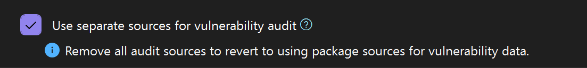

# **NuGet Audit Sources in Visual Studio Options**

- Author: Donnie Goodson (<https://github.com/donnie-msft>)
- GitHub Issue: <https://github.com/nuget/home/issues/14583>

## **Summary**

Visual Studio currently supports NuGet Audit to help developers identify vulnerable packages. As adoption grows, customers need a convenient way to manage **Audit Sources** directly from the Visual Studio Options UI, rather than editing `nuget.config` manually. This proposal introduces first-class support for adding, removing, and updating Audit Sources in Visual Studio.

## **Motivation**

Pain-points today:

- Customers must manually edit `NuGet.Config` to configure `<auditSources>`.
  There can be multiple files containing this configuration.
- Lack of discoverability for audit-related settings in Visual Studio.

## **Explanation**

### **Functional Explanation**

Add an **"Audit Sources"** table to the "Package Sources" page in NuGet's Visual Studio Options.
The audit source table will show the same columns as package sources:
**Warnings/Errors, Enabled, Name, Source, Allow Insecure Connections** (note that mockups may not reflect all columns).

- **Discoverability**: Enable Quick Search (Ctrl+Q) so that searching for "Audit Source" navigates to the Package Sources page in Unified Settings.
- Up to **Three Tables** can be shown in this order:
  - Package Sources (always shown)
  - Audit Sources (shown when explicitly configured),
  - Machine-wide Package Sources (shown when explicitly configured)
- New Checkbox: **Use separate sources for vulnerability audit**
  - Introduce a Checkbox control that when checked, shows a table for adding Audit Sources.
  
    - At least 1 audit source must be added to persist the effect of this setting.
    Otherwise, checking the box and closing VS and reopening this setting, the checkbox will now be unchecked since no audit sources are found.
      - In a future iteration, checking the box may be able to automatically open the Add Audit Source dialog.
      Unified Settings does not currently have this support.
    - When none are configured, the Audit Sources table will be **hidden**.
  - When one or more audit source is already configured, the Audit Sources table appears by default.
  - The Checkbox is **disabled** and a message indicates how to go back to using Package Sources:
      > "Remove all audit sources to revert to using package sources for vulnerability data."
    - If customers want the ability to switch back from their audit sources to only package sources for Vulnerability data, a future iteration could support this and automatically clear `<auditSources>` after showing a warning Messagebox that can be cancelled.

_Mockup_: Table of Audit Sources shown below Package Sources because Checkbox  option "Use separate sources for vulnerability audit" is selected.

#### Describe Package versus Audit sources

Before each table, introduce descriptive text to reinforce with customers how Package Sources and Audit Sources work together.

- **Package sources**:
  > Package sources define where NuGet retrieves packages for install, restore, audit, and update operations. [Learn more about package sources](https://learn.microsoft.com/nuget/reference/nuget-config-file#packagesources)

- **Audit sources**:

  > Audit sources provide vulnerability data during restore with
out acting as package sources. If no audit sources are configured, NuGet Audit uses package sources and suppresses warning NU1905. [Learn more about audit sources](https://learn.microsoft.com/nuget/reference/nuget-config-file#auditsources)

### **Technical Explanation**

- Add an array setting titled "Audit Sources" to the "Package Sources" NuGet options page in the Unified Settings registration.json file.
- Make the "Audit Sources" array setting hidden unless the "Use separate sources for vulnerability audit" value is `true` (Checked).
- Use existing NuGet.Configuration APIs to read/write `<auditSources>` in `nuget.config` files.

#### Telemetry

- Track management actions (add/remove/enable) of audit sources to better understand customer needs.

## **Drawbacks**

- Potential confusion for package sources that act as audit sources implicitly by having a vulnerability resource.
The Checkbox is an attempt to make this more clear, and we can measure its impact and feedback from customers.

## **Rationale and Alternatives**

### Alternative 1: Always show Audit Sources table

No ComboBox to select - the Audit Sources table will always be available below package sources, relying on explanatory text to explain the behavior changes if any are configured.

### Alternative 2: Create a Separate Options Page

Rather than share the page with Package Sources, create a new section, **Audit Sources**

- Advantages:

  - Less clutter on the Package Sources page.

- Disadvantages:

  - Separate UI for Package & Audit sources is potentially confusing, or at least more cumbersome for customers, as they are conceptually tightly related.
  - More duplication of code to setup a separate page which is nearly identical to the Package Sources page.

### Alternative 3: Audit Source Property on Package Sources

Add a new column to the Package Sources table, which is a property to configure how that package source behaves in regard to NuGet Audit.

Options include:

- "Package Source"
  - Create only a `<packageSource>` entry for this source.
  - This is treated as a package source, which could potentially be an implicit audit source. (*)See footnote

- "Audit Source"
  - Create only an `<auditSource>` entry for this source.

- "Both"
  - Create both a `<packageSource>` and `<auditSource>` entry for this source.

(*) The concern here is regarding confusion, because NuGet restore will sometimes use package sources for vulnerability data.
That scenario is when no `<auditSources>` have been configured, and an existing package source provides the VulnerabilityInfo resource.
Would setting the Audit property here to "Package Source" be clear that it _could_ be an audit source?
How does that differ from selecting "Both"?

## **Prior Art**

- Audit Sources are used by NuGet's CLI tooling and recently supported in Visual Studio.
- NuGet.Config support for audit sources was implemented consistently with other settings, so it follows that UI tooling to manage those audit sources would build upon that work.

## **Unresolved Questions**

None at this time

## **Future Possibilities**

1. Consider UI for Package Sources that are implicitly audit sources
    1. For implicit audit sources, modify the Package Sources table to show a checkbox or similar indicator that the package source provides vulnerability data.
    1. Validate audit source URLs by checking for `VulnerabilityInfo` resource in the service index.
1. Should there be a button to add `nuget.org` as an audit source?
1. Work with Unified Settings team to reduce whitespace due to a fixed-height table.
Today, if only 1 package source is shown, for example, the array is still around 6 rows in height.
Real estate is lost and this requires customers to unnecessarily scroll down to see audit sources.
